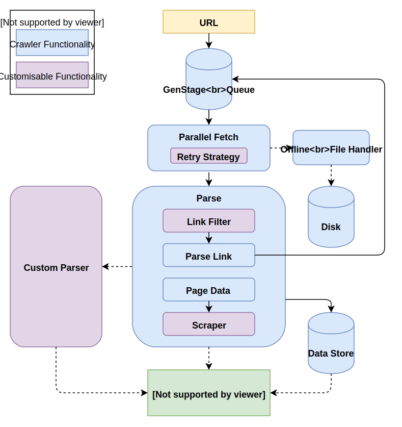

# Crawler

[](https://travis-ci.org/fredwu/crawler)
[](https://codeclimate.com/github/fredwu/crawler)
[](https://codebeat.co/projects/github-com-fredwu-crawler-master)
[](https://coveralls.io/github/fredwu/crawler?branch=master)
[](https://hex.pm/packages/crawler)

A high performance web crawler in Elixir, with worker pooling and rate limiting via [OPQ](https://github.com/fredwu/opq).

## Features

Crawler is under active development, below is a non-comprehensive list of features (to be) implemented.

- [x] Set the maximum crawl depth.
- [x] Save to disk.
- [x] Set timeouts.
- [x] Crawl assets.
  - [x] js
  - [x] css
  - [x] images
- [ ] The ability to manually stop/pause/restart the crawler.
- [x] Restrict crawlable domains, paths or file types.
- [x] Limit concurrent crawlers.
- [x] Limit rate of crawling.
- [x] Set crawler's user agent.
- [x] The ability to retry a failed crawl.
- [ ] DSL for scraping page content.

## Architecture

Below is a very high level architecture diagram demonstrating how Crawler works.



## Usage

```elixir
Crawler.crawl("http://elixir-lang.org", max_depths: 2)
```

## Configurations

| Option          | Type    | Default Value               | Description |
|-----------------|---------|-----------------------------|-------------|
| `:max_depths`   | integer | `3`                         | Maximum nested depth of pages to crawl.
| `:workers`      | integer | `10`                        | Maximum number of concurrent workers for crawling.
| `:interval`     | integer | `0`                         | Rate limit control - number of milliseconds before crawling more pages, defaults to `0` which is effectively no rate limit.
| `:timeout`      | integer | `5000`                      | Timeout value for fetching a page, in ms.
| `:user_agent`   | string  | `Crawler/x.x.x (...)`       | User-Agent value sent by the fetch requests.
| `:save_to`      | string  | `nil`                       | When provided, the path for saving crawled pages.
| `:assets`       | list    | `[]`                        | Whether to fetch any asset files, available options: `"css"`, `"js"`, `"images"`.
| `:retrier`      | module  | `Crawler.Fetcher.Retrier`   | Custom fetch retrier, useful when you need to retry failed crawls.
| `:url_filter`   | module  | `Crawler.Fetcher.UrlFilter` | Custom URL filter, useful when you need to restrict crawlable domains, paths or file types.
| `:parser`       | module  | `Crawler.Parser`            | Custom parser, useful when you need to handle parsing differently or to add extra functionalities.

## Custom Modules

It is possible to swap in your custom logic as shown in the configurations section. Your custom modules need to conform to their respective behaviours:

### Retrier

See [`Crawler.Fetcher.Retrier`](lib/crawler/fetcher/retrier.ex).

Crawler uses [ElixirRetry](https://github.com/safwank/ElixirRetry)'s exponential backoff strategy by default.

```elixir
defmodule CustomRetrier do
  @behaviour Crawler.Fetcher.Retrier.Spec
end
```

### URL Filter

See [`Crawler.Fetcher.UrlFilter`](lib/crawler/fetcher/url_filter.ex).

```elixir
defmodule CustomUrlFilter do
  @behaviour Crawler.Fetcher.UrlFilter.Spec
end
```

### Parser

See [`Crawler.Parser`](lib/crawler/parser.ex).

```elixir
defmodule CustomParser do
  @behaviour Crawler.Parser.Spec
end
```

## Changelog

Please see [CHANGELOG.md](CHANGELOG.md).

## License

Licensed under [MIT](http://fredwu.mit-license.org/).
